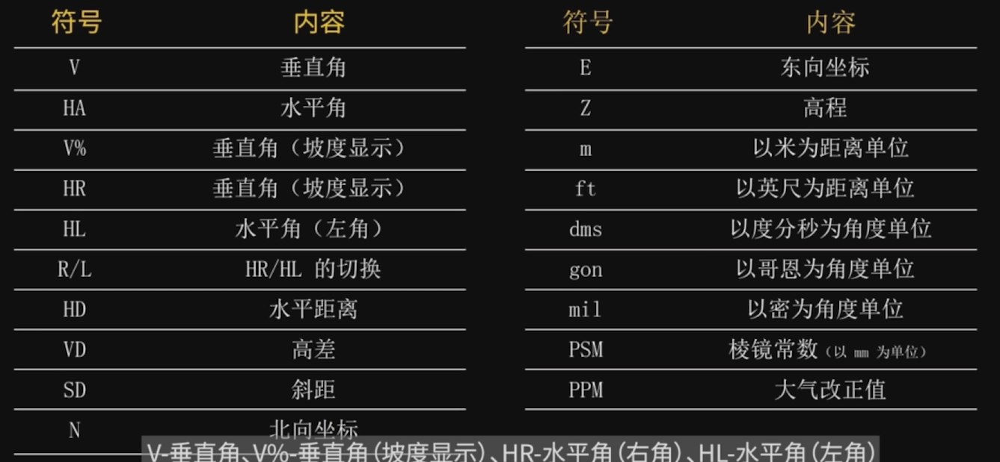
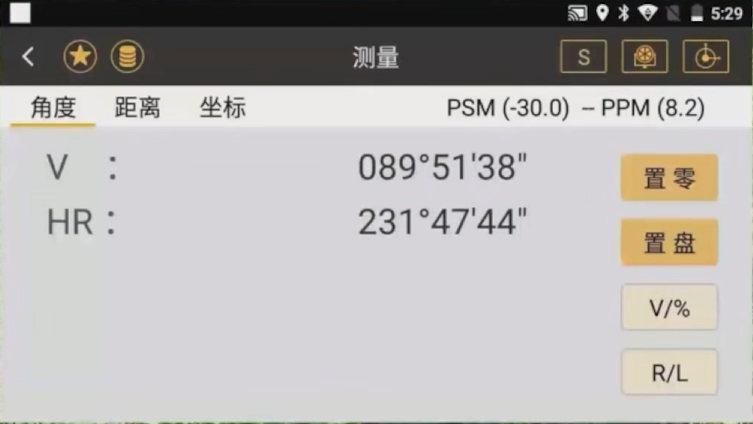
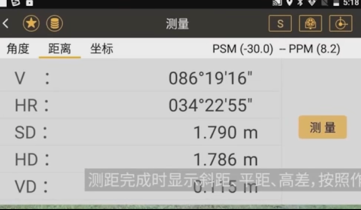
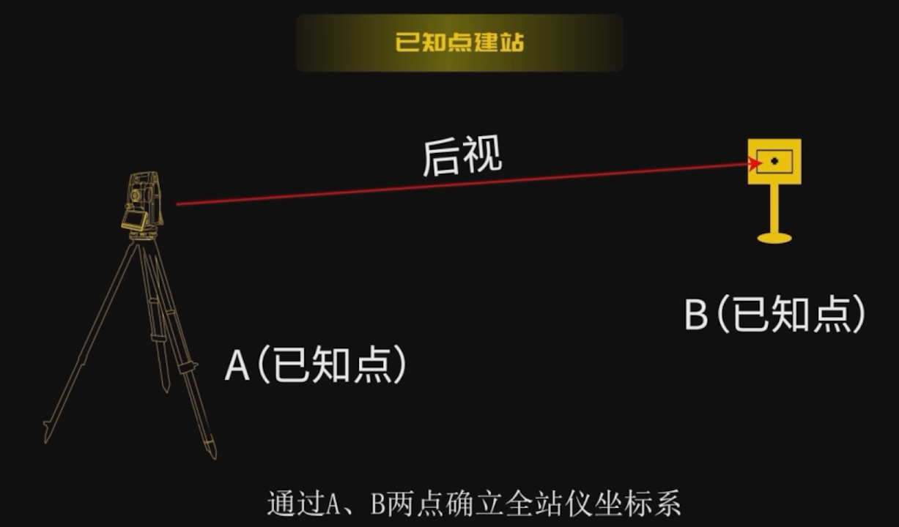
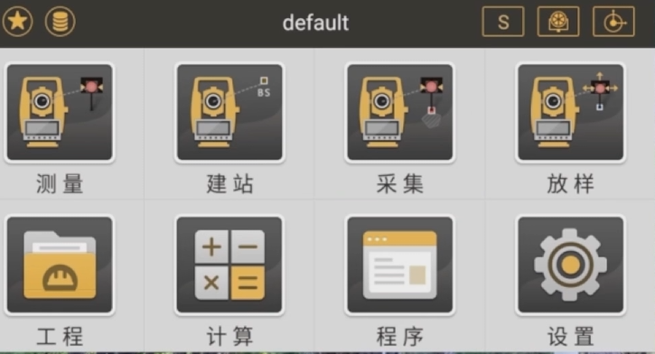
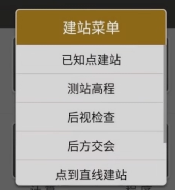
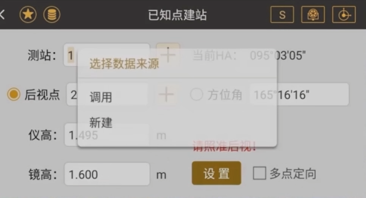
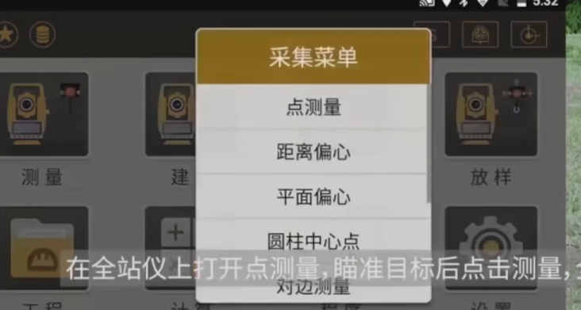
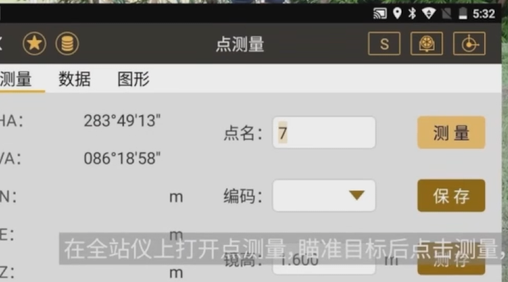
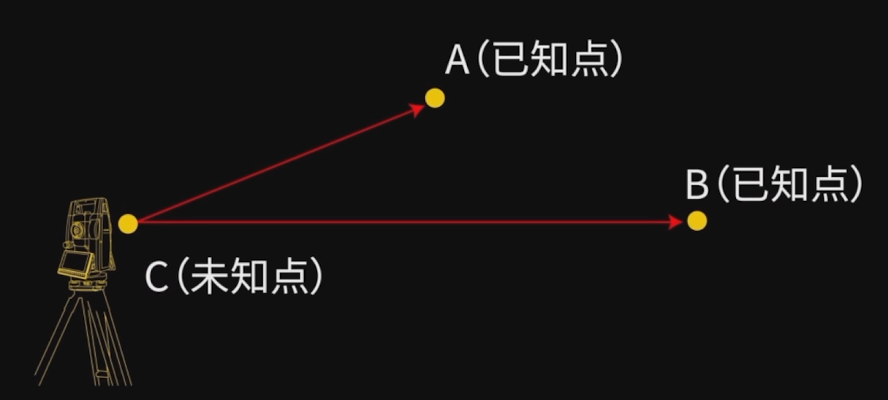

## 角度指标

市面上普遍是 2 秒或者 5 秒，少数 1 秒和 0.5 秒
552 安卓智能全站仪角度指标为 2 秒

## 距离指标

为+-(2+2ppm\*D),2mm 是固定误差（加常熟的测定误差，对中误差，测相误差。。。）

固定误差与距离没有关系

## 智能全站仪常用符号表

## 使用流程

### 对中整平

打开脚架并安置好仪器，打开仪器激光对中器进行对中，对中后需调整脚架高度进行粗平，使圆水准气泡居中，由于在调整脚架过程中会使全站仪位置发生微动，所以需要轻微移动全站仪再次进行对中，最后精平，我们需要转动全站仪使水准管与任意两个脚螺旋平行，通过调整脚螺旋使水准管气泡居中，然后转动全站仪，并重复上述步骤，使全站仪在各个方向上水准管气泡都居中，最后再次观察激光点与控制点是否重
合，若不重合，轻微移动全站仪，这样全站仪的对中整平工作就完成了。

### 测角

使用测回法测量角度，首先，盘左照准方向 A，点击置零，照准方向 B，读取角度值，并用铅笔记录在表格上，转动仪器，用盘右找准方向 B，读数并记录数据，然后找准方向 A 获得归零读数，记录数据，在完成一个测回后，进行核算，保证角度数据的高度准确。

### 测距

照准目标棱镜中心，按测距键，距离测量开始，距离完成时显示斜距、平距、高差，按照作业需求，读取平距或斜距并进行记录。

### 调整单位

在测绘之星上打开设置菜单，下滑找到单位设置，进行测角测距的单位设置

## 点坐标测量或放样

### 首先完成全站仪的建站工作

nts552 建站可分为：

- 已知点建站
- 后方交会

#### 已知点建站

它是在一个已知点上建立极坐标，然后照准已知的后视点，定好该坐标系的北方向，最后计算出方位角

在全站仪打开已知点建站功能，调用已知的建站点和后视点坐标，照准视点方向，量取并输入仪器高。

在全站仪上打开点测量，瞄准目标后点击测量，全站仪即可自动计算出目标点的准确坐标

智能全站仪还可以测量出多点之间的位置关系

#### 后方交会

它是通过后视两个已知点，计算出任意架站的建站点的坐标，该方法可以帮助用户在更适合的点位进行建站作业

